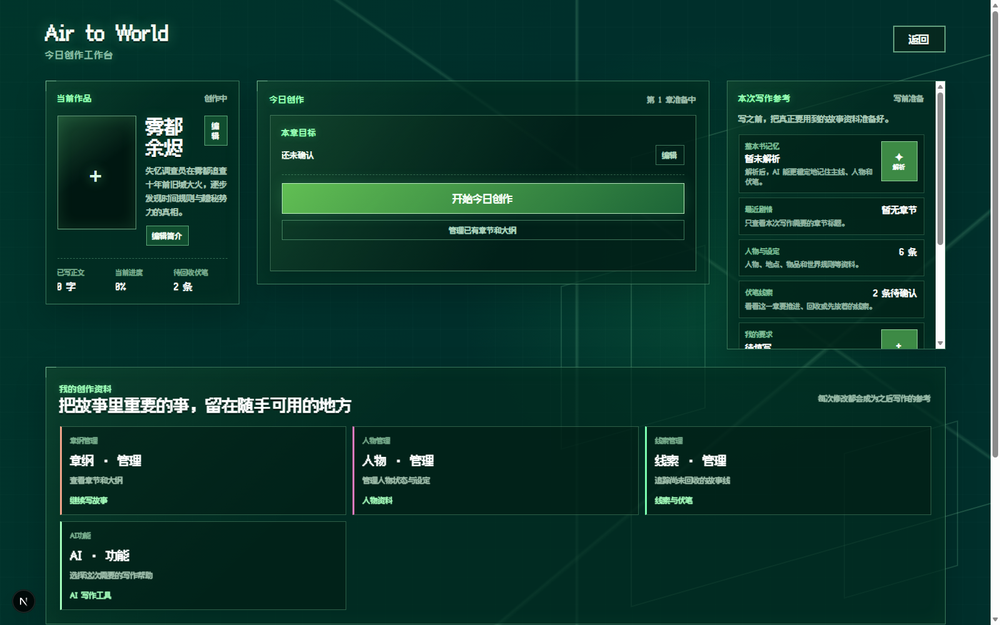
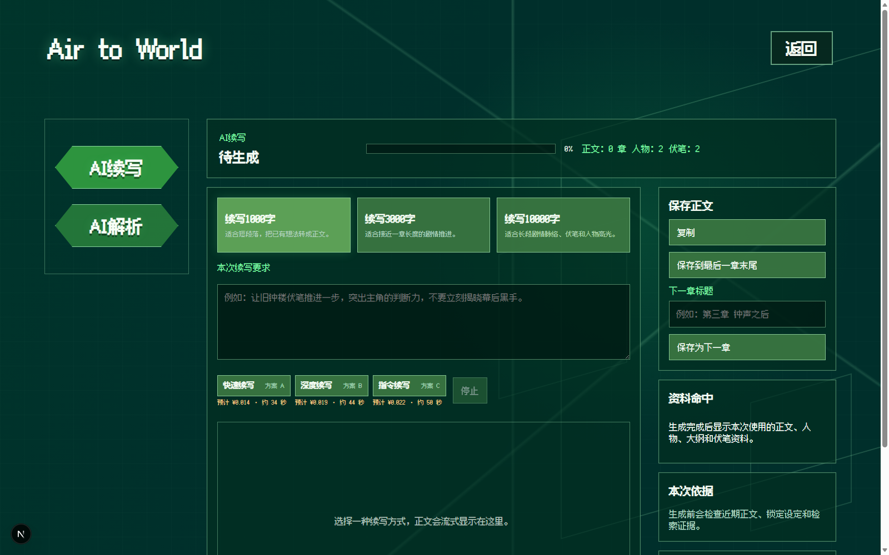

# AI 长篇小说创作辅助平台

面向长篇小说作者的创作辅助 Web 应用。它不把续写理解为“根据上一段继续生成”，而是把章节、人物、线索、章纲和作者意图作为可持续维护的上下文资产，在指定断点生成可追溯、可修改的续写草稿。

## 为什么不是普通下一段续写

普通对话式 LLM 或编辑器内置续写通常只看到临时粘贴的片段，难以维护跨章节设定，也无法让作者持续管理哪些资料必须遵守。本项目围绕长篇上下文管理设计：

- 用章节快照定义知识截止点，避免未来章节信息泄漏。
- 用人物、线索与章纲治理沉淀作者确认的创作资产。
- 根据当前断点与写作目标检索、过滤并组装相关证据。
- 将作者锁定的、与当前场景直接相关的约束注入生成链路。
- 提供快速、深度、指令三种续写策略，显式展示预计成本与等待时间。

## 核心能力

| 能力 | 说明 |
| --- | --- |
| 章节与快照 | 按章节管理正文和章纲；快照冻结可用知识范围。 |
| 人物与线索治理 | 作者可编辑、确认、忽略或锁定人物属性和线索。 |
| RAG 上下文 | 从截止点前资料中检索当前断点相关证据，减少无关上下文。 |
| 模块化提示词 | 分层组合续写目标、证据、作者约束、场景边界与输出格式。 |
| 生成可靠性 | 处理空响应、超时、JSON 异常和文本截断，支持定向重试。 |
| 实验闭环 | 以 RAG 敏感、约束敏感、开放创作题验证不同上下文策略。 |

## 页面预览

| 创作工作台 | AI 续写 |
| --- | --- |
|  |  |

## 技术方案

```text
章节正文 + 章纲 + 人物 + 线索 + 作者要求
                    ↓
快照截止点 → 检索与过滤 → 动态上下文拼装
                    ↓
快速续写 / 深度续写 / 指令续写
                    ↓
完整性检查 → 保存 → 质量评测与定向重跑
```

详细设计见：

- [产品架构](docs/public/ARCHITECTURE.md)
- [实验与质量验证](docs/public/EVALUATION.md)
- [公开发布前检查清单](docs/public/PUBLIC_RELEASE_CHECKLIST.md)

## 本地启动

### 前置条件

- Node.js 20+
- Docker Desktop（本地 PostgreSQL + pgvector）
- 可兼容 OpenAI API 的模型服务

### 步骤

```bash
cp .env.example .env.local
npm install
npm run db:up
npm run db:migrate
npm run dev
```

访问 `http://localhost:3000`。请在 `.env.local` 填入自己的模型服务地址与 API Key；密钥只由服务端读取，不应提交到 Git。

## Demo 数据与数据边界

公开版本仅使用虚构的演示作品与示例人物、线索数据。任何真实小说原文、快照、向量索引、生成记录、实验日志和密钥均不属于公开仓库内容。详见 [Demo 数据说明](data/demo/README.md)。

## 项目定位

该项目用于展示 AI 产品设计与工程实现：RAG、上下文管理、提示词工程、LLM 幻觉控制、生成稳定性和评测闭环。评测是验证创作链路的工具，而非产品的主功能。

## License

本项目以 [MIT License](LICENSE) 发布。
